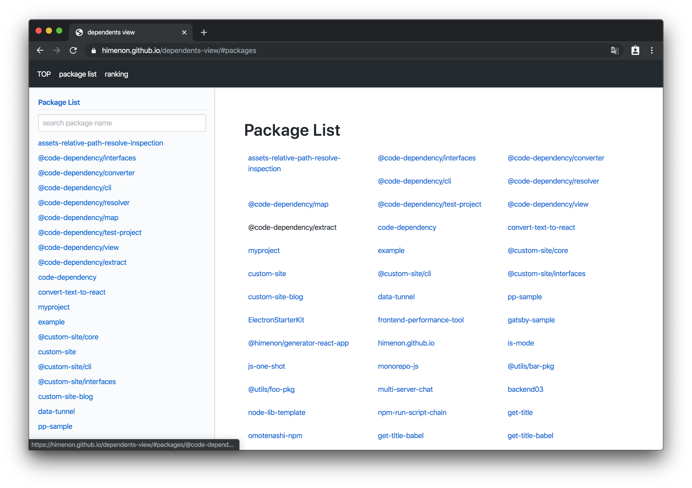

# dependents-view

## Usage

1. clone (or fork)

```bash
git clone https://github.com/Himenon/dependents-view.git
cd dependents-view
yarn
```

2. Generate token https://github.com/settings/tokens and set environment `GITHUB_TOKEN` value.
3. Change `scripts/Constants.ts` setting value.
4. Change `package.json` `homepage` value (your hosting site base path)
5. run
   ```bash
   # if organization
   yarn extract:package-json:org
   # if user
   yarn extract:package-json:user
   ```
6. make client side data set

```bash
yarn make:dependency:data
yarn make:ranking:data
```

7. Check `yarn start`
8. Build `yarn build`
9. Publish `yarn publish:site` (GitHub Pages Only)

## Sample page

DEMO Page: https://himenon.github.io/dependents-view/

### Package list page



### Ranking page


## Start Development

```bash
yarn
yarn start # start debug server
```

## Build

```bash
yarn run build
```

### Release

```bash
yarn run publish:site # default release: github pages
```

### Run server

```bash
yarn run serve
```

## Code Format

```bash
yarn run format
```

## License

MIT
